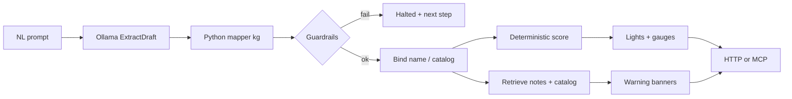

# Overdone — stack, mapping, and decisions

Portfolio note for a **local diagnostic scratchpad**: import a training log, propose an increment in plain language, get Green / Yellow / Red plus gauges. Evaluations are not stored. There is no auth; one operator, one Postgres.

The interesting part is not the workout domain. It is where the LLM is allowed to speak, where it is forbidden, and how the rest of the system stays testable.

## Tech stack

| Layer | Choice | Why it is here |
| --- | --- | --- |
| UI | Next.js 15 App Router, React 19 | Server load of health + baseline; client scratchpad for evaluate |
| Styling | Pigment CSS (`css()`), MUI packages installed | Build-time CSS extract; webpack only (no Turbopack) |
| HTTP API | FastAPI + Pydantic v2 | Typed contracts; halt vs verdict in one response model |
| Agent tools | FastMCP on `/mcp` | Same evaluate/baseline as HTTP, for a tool-calling client |
| Extract | Pydantic AI `NativeOutput[ExtractDraft]` over OpenAI-compatible `/v1` | Constrained JSON from Ollama (`llama3.2` locally) |
| Embeddings | MiniLM-L6-v2 (384-d) via LlamaIndex HuggingFace embed | Catalog + session-note vectors |
| Store | Postgres 16 + pgvector, SQLAlchemy 2 async, Alembic | HNSW cosine index; GIN on embedding metadata |
| Ingest | LlamaIndex-shaped nodes into `data_embeddings` | Exercise chunks, names/aliases, session notes |
| Policy | Pure Python scoring in canonical **kg** | Lights and gauges do not come from the model |
| Tests | Pytest (API) + Vitest (UI parsers) | Pytest never calls Ollama or downloads MiniLM |
| Run | Compose files in-repo; local uvicorn + Next also supported | `BOOTSTRAP` migrates and seeds an empty catalog |

CPU Torch is pinned for the API image so the container does not pull a CUDA wheel it will not use. Host Ollama can still use a GPU.

## Enterprise AI patterns in play

This is a single-user POC. The names are the **patterns**, not a claim that Overdone is a multi-tenant platform.

| Pattern | How it shows up |
| --- | --- |
| Constrained generation | Pydantic AI `NativeOutput[ExtractDraft]`. The model fills a slim native-unit draft — not kg, catalog ids, or scores. |
| Anti-corruption layer | `extract_map.py` maps that draft to `ExtractedPrompt` (kg, sets×reps, weeks). |
| Eval harness / prompt contract | `golden_extract.json` is both few-shot and live eval. Pytest never calls Ollama. |
| Guardrails | No regex fallback. Unset `OLLAMA_BASE_URL` → evaluate does not mount. Bad extract → `halted`. |
| Deterministic policy | `scoring.py` in canonical kg. Named prescriptions (e.g. 3×8) are scored as named. |
| RAG as context, not authority | Session notes and catalog chunks can banner or cite. They do not change lights. |
| Entity resolution | Baseline string match first; else one pgvector lookup over name/alias embeddings. |
| Feature store (tiny) | Axial / CNS / joint coefficients seeded with the catalog. |
| Typed control-flow | Missing baseline, unknown lift, mixed units, extract failure — halt with a next step, not a guessed Green. |
| Hermetic vector CI | Embedding fixture. Missing text is a `KeyError`, not a silent MiniLM download. |
| Contract at the edge | UI `parseEvaluationResult` refuses malformed evaluate JSON. |
| No write-back of model output | Verdicts are scratchpad-only. The imported log is what persists. |

## MCP as a developer workflow

The product is the Next scratchpad on REST. MCP is not a second UX and not a coach/CI pipeline. It is how we **dogfood the same evaluate loop from Cursor** while working on the app — attach a log, call tools, inspect a halt or a light, throw the verdict away — without standing up in-app chat.

Clone-and-run: `.cursor/mcp.json` points at `http://127.0.0.1:8000/mcp`, a project rule describes the loop, and [cursor-mcp-workflow.md](cursor-mcp-workflow.md) is the script. Prefer `evaluate_prompt(prompt, log=...)` so a chat does not overwrite the UI baseline. `extract` on the tool body is for phrasing debug, not a second scorer.

`mcp/server.py` stays a thin adapter over `evaluate.py` / `replace_baseline`. Pytest checks the MCP body equals `POST /api/v1/evaluate` for the same prompt. If the host can already call REST, it does not need this; we ship it because Cursor is the editor we develop in.

## Decisions and optimizations

### 1. The model is a parser, not a coach

Enterprise demos often let the LLM both extract and decide. Here the model is limited to **what was said** (lift nickname, spoken number, unit if named, sets×reps if named, fatigue phrase, substitution ask). Scoring, unit conversion, and “is this overdone?” stay in Python so a gold extract set and a scoring unit test can disagree with the model independently.

### 2. Slim draft vs rich domain object

`ExtractDraft` stays in lb/kg as spoken and omits unused fields (`null` strings are stripped). The mapper owns kilograms and macro horizon. That split is the same idea as “LLM emits vendor JSON; domain layer emits the canonical DTO.”

### 3. Fail closed, including the old regex

A regex extractor on unpolished gym English looks green in a demo and lies in production. Extract is required. Timeout is bounded (`ollama_timeout_seconds`). Failure is a halt with a retry instruction, not a heuristic 3×5.

### 4. Few-shot cannot drift from eval

Instruction examples are loaded from `golden_extract.json` (`fewshot: true`). The human-readable set is `docs/golden-extract-dataset.md`. Regenerating JSON from `_gen_golden_extract.py` is the only edit path. That is “eval set is the contract,” not a prompt file that bit-rots.

### 5. RAG is advisory

Shoulder-tight notes can banner. They must not flip Green to Red by themselves. That is how you keep retrieval from becoming an untested policy. Citations (`catalog_source_id`) are for provenance.

### 6. One vector round-trip for nicknames

Resolve does not scan exercise chunks and name vectors as two product queries. `search_embeddings(..., kinds=("exercise", "exercise_name"), distinct_on_kind=True)` is one HNSW lookup. Aliases are **embedded at seed** (name nodes), not regex-expanded at query time.

### 7. MiniLM off the event loop

`embed_texts` / `embed_query` run the HuggingFace batch in `asyncio.to_thread`. Encode is CPU-heavy; leaving it on the FastAPI loop would stall evaluate and seed. Same isolation idea as “don’t block the gateway thread on embedding.”

### 8. Tests do not pretend to be the model

Pytest injects a scripted extract client and a **fail-closed embedding fixture**. Optional live eval is an explicit env flag. That is the unit/integration vs eval-harness split: CI stays deterministic; model quality is a separate job.

### 9. Dual interface, one orchestrator

See [MCP as a developer workflow](#mcp-as-a-developer-workflow). Tools call the same `evaluate_prompt` / `replace_baseline` as the routers. Halt semantics cannot fork by transport.

### 10. Schema and UI contracts

DB CHECKs lock `lb`/`kg`. Alembic HNSW (`vector_cosine_ops`) plus GIN on `metadata_` support filtered ANN. The UI parses evaluate payloads instead of casting `as EvaluationResult`, which is the browser-side analogue of “don’t trust the wire.”

### 11. Pigment without transforming `@mui/material`

MUI 9.4 `transformLibraries: ['@mui/material']` blew up at build (Typography / TouchRipple). Product CSS is Pigment `css()`; only `@mui/material-pigment-css` is transformed; `optimizePackageImports` stays on for `@mui/material`. Turbopack is off because the Pigment Next plugin is webpack-only. That is build-graph literacy, not a theme preference.

### 12. Sample log is a two-week PPL, not a single set

`data/sample_baseline.*` is Metallicadpa-style PPLPPL with linear progress. Volume and velocity scoring need history; a one-session 4×5 cannot show that. The mini catalog fixture includes those lifts so pytest can import the same file the UI pastes.

## Deliberately out of scope

No accounts, no stored evaluations, no fine-tuning, no graph DB, no “the model will just be careful.” Those are product and safety choices: a portfolio slice should show **control of the loop**, not a larger surface that hides the loop.

## Where to look in the repo

| Question | Path |
| --- | --- |
| Orchestrator | `backend/src/overdone/services/evaluate.py` |
| Draft schema | `backend/src/overdone/schemas/extract_draft.py` |
| LLM client | `backend/src/overdone/services/extract_llm.py` |
| Mapper | `backend/src/overdone/services/extract_map.py` |
| Lights / gauges | `backend/src/overdone/services/scoring.py` |
| RAG | `backend/src/overdone/services/retrieve.py` |
| Resolve | `backend/src/overdone/services/resolve.py` |
| MCP | `backend/src/overdone/mcp/server.py` |
| Cursor clone-and-run | `docs/cursor-mcp-workflow.md` |
| Embed isolation | `backend/src/overdone/ingest/embed.py` |
| Indexes | `backend/alembic/versions/d0bed36fc3fa_add_embedding_indexes_and_unit_checks.py` |
| Gold extract | `docs/golden-extract-dataset.md` |
| UI contract | `frontend/src/lib/evaluate.ts` |
